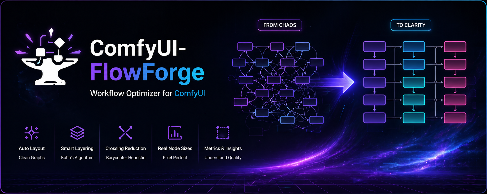

# ComfyUI FlowForge

Automatically rearranges nodes in a [ComfyUI](https://github.com/comfyanonymous/ComfyUI) workflow JSON file so that data flows left-to-right and connection lines stop crossing each other.

---

## The Problem

ComfyUI workflows grow organically. Nodes get added wherever there is space, moved around during iteration, and groups get reorganised. The result is a canvas where connection lines criss-cross in every direction — hard to read and hard to debug.

FlowForge reads a workflow JSON, computes a clean left-to-right layout using a graph algorithm, and writes the result back. **Only node positions and group bounding boxes are changed.** Every connection, setting, model reference, and widget value is preserved exactly.

---

## Requirements

- [uv](https://docs.astral.sh/uv/) — handles Python and all dependencies automatically
- Python ≥ 3.10 (installed automatically by uv if not present)

No external runtime dependencies — the layout algorithm uses the Python standard library only.

---

## Installation

### 1 — Install uv (once per machine)

**Windows** (PowerShell):
```powershell
powershell -ExecutionPolicy ByPass -c "irm https://astral.sh/uv/install.ps1 | iex"
```

**macOS / Linux**:
```bash
curl -LsSf https://astral.sh/uv/install.sh | sh
```

### 2 — Clone and set up

```bash
git clone https://github.com/Delcado19/comfyui-flowforge.git
cd comfyui-flowforge
uv sync
```

`uv sync` creates a `.venv` folder and installs everything. This takes about 10 seconds on first run.

### 3 — Make the launcher executable (macOS / Linux only)

```bash
chmod +x flowforge.sh
```

---

## Quick Start

| Platform | How to launch |
|---|---|
| **Windows** | Double-click `flowforge.bat` |
| **macOS** | `./flowforge.sh` in Terminal |
| **Linux** | `./flowforge.sh` in Terminal |

When launched without a file argument, a native file picker opens. Select any ComfyUI workflow `.json` file — FlowForge writes a `_layouted.json` file next to it and exits.

---

## Usage

```
flowforge.bat [input] [options]        # Windows
./flowforge.sh [input] [options]       # macOS / Linux
```

Or directly via uv on any platform:

```bash
uv run python flowforge.py [input] [options]
```

| Option | Description |
|---|---|
| `input` | Path to the ComfyUI workflow JSON file. **Optional** — if omitted, a native file picker opens. |
| `-o PATH`, `--output PATH` | Write result to this path. Default: `<input>_layouted.json` in the same directory. |
| `--inplace` | Overwrite the input file directly. |

### Examples

```bash
# Open the file picker
./flowforge.sh

# Produce a new file next to the original
./flowforge.sh my_workflow.json
# → writes my_workflow_layouted.json

# Specify output path
./flowforge.sh my_workflow.json -o clean/my_workflow.json

# Overwrite in place
./flowforge.sh my_workflow.json --inplace
```

The file picker uses Python's built-in `tkinter.filedialog` — no extra dependencies. It opens the native dialog on Windows and macOS, and a Tk-based dialog on Linux. On minimal Linux installs without Tk, install `python3-tk` via your system package manager (`sudo apt install python3-tk` on Debian/Ubuntu).

---

## What Gets Changed

| Field | Changed? | Details |
|---|---|---|
| `nodes[].pos` | **Yes** | Recomputed by the layout algorithm. |
| `groups[].bounding` | **Yes** | Recalculated from the final node positions. |
| `extra.ds.offset` | **Yes** | Reset to `[0, 0]` so ComfyUI opens the result in view. |
| `extra.ds.scale` | **Yes** | Reset to `1.0`. |
| `nodes[].size` | No | Node dimensions are read but never written back. |
| `links` | No | All connections preserved exactly. |
| `nodes[].widgets_values` | No | All settings, prompts, model references preserved. |
| `nodes[].mode` | No | Active / bypassed state preserved. |
| `nodes[].order` | No | Execution order preserved. |
| All other fields | No | Colors, types, titles, properties — untouched. |

---

## How It Works

FlowForge implements a six-phase pipeline:

### Phase 1 — Group Membership

Every node is assigned to the group whose bounding box contains it (using the node's original position). Nodes outside every group form an implicit ungrouped set. When groups overlap, the first matching group in workflow order wins.

### Phase 2 — Inter-Group Topology

A directed graph is built between groups: a group A gets an edge to group B whenever a link crosses from a node in A to a node in B. This graph is topologically sorted using the longest-path algorithm (Kahn's BFS + depth tracking). Groups are assigned to columns from left to right in dependency order. Groups with no ordering relationship share the same column and are stacked vertically, sorted by their original vertical centroid to preserve the author's intended arrangement.

### Phase 3 — Internal Layout (Sugiyama)

Within each group, independently:

1. **Layer assignment** — each node receives a layer number equal to the longest path from any source node to it (`layer = max(layer[predecessor]) + 1`, with sources at layer 0). Uses a topological sort; nodes in cycles (rare in valid ComfyUI workflows) fall back to layer 0.
2. **Crossing minimisation** — nodes within each layer are reordered using the _barycenter heuristic_: each node's score is the average position of its neighbours in the adjacent layer. Two passes are run (forward then backward) to reduce edge crossings.
3. **Coordinate assignment** — nodes are placed on a grid: X increases by layer, Y increases by position within the layer. Bypassed nodes (`mode = 4`) are sorted to the end of their layer so they don't interrupt the active flow.

### Phase 4 — Global Positioning

The content size of every group is known after Phase 3. Column widths are determined by the widest group in each column. Groups are placed left-to-right by column and top-to-bottom within each column. Group padding is added around the content area. Node positions are translated from group-local coordinates to global canvas coordinates.

### Phase 5 — Decorative Nodes

Comment nodes (`Note`, `MarkdownNote`, `Label`) carry no dataflow edges and are excluded from the graph algorithm. After layout they are repositioned by computing the original offset vector from each decorative node to its nearest layout node (in original coordinates) and applying the same offset to the layout node's new position. This keeps notes visually attached to the nodes they describe.

### Phase 6 — Bounding Box Update

Each group's `bounding` rectangle is recalculated from the final positions of its member nodes plus the group padding.

### Spacing Defaults

All spacing is defined as module-level constants in `flowforge/layout.py` and can be adjusted:

| Constant | Default | Description |
|---|---|---|
| `NODE_H_GAP` | 80 px | Horizontal gap between node columns within a group. |
| `NODE_V_GAP` | 40 px | Vertical gap between nodes in the same column. |
| `GROUP_H_GAP` | 200 px | Horizontal gap between group columns. |
| `GROUP_V_GAP` | 100 px | Vertical gap between groups stacked in the same column. |
| `GROUP_PADDING` | 50 px | Padding inside a group's bounding box. |

---

## Known Limitations

**Bidirectional inter-group dependencies.** Some workflows contain groups that both produce data for and consume data from the same other group or the ungrouped set (e.g. a "Reference input" group that preprocesses images but also receives conditioning from the main pipeline). This creates a cycle in the inter-group dependency graph. FlowForge breaks cycles by appending the involved groups to the last column, which means a small number of cross-group links will point backwards. In practice this affects fewer than 20 % of links in such workflows and the overall layout is still significantly cleaner than the original.

**Group overlap in the original workflow.** If a node's original position lies inside multiple overlapping group bounding boxes, it is assigned to the first group in workflow order. This is the same behaviour as ComfyUI itself.

**Sub-graph nodes.** Nodes whose type is a UUID (ComfyUI inline sub-graphs) are treated as opaque black boxes. Their internal nodes are not rearranged.

---

## Project Structure

```
comfyui-flowforge/
│
├── flowforge.bat             Windows launcher (double-click or run from cmd)
├── flowforge.sh              macOS / Linux launcher
├── flowforge.py              Python entry point shim
│
├── flowforge/
│   ├── __init__.py
│   ├── model.py              Data classes: Node, Link, Group, Workflow
│   ├── parser.py             JSON → Workflow; normalises size formats,
│   │                         builds synthetic SetNode→GetNode links
│   ├── layout.py             6-phase Sugiyama layout algorithm
│   └── cli.py                Argument parsing, file picker, JSON writer
│
├── assets/
│   └── social-preview.png
│
├── tests/
│   ├── test_parser.py        Parser invariants across all example workflows
│   └── test_layout.py        Layout invariants (unit + integration)
│
├── pyproject.toml            UV project config, entry points, dev deps
├── uv.lock                   Locked dependency versions
└── .gitignore
```

---

## Development

Set up the environment:

```bash
uv sync
```

Run the test suite:

```bash
uv run pytest
```

### Adding Test Workflows

Place ComfyUI workflow JSON files in `example-workflows/`. The test suite picks them up automatically via glob. The directory is listed in `.gitignore` and is not committed to the repository.

### Module Overview

| Module | Responsibility |
|---|---|
| `model.py` | Pure data structures. No I/O, no logic. |
| `parser.py` | Reads JSON, normalises fields, produces `Workflow`. Public API: `load(path)`. |
| `layout.py` | Mutates `node.pos` and `group.bounding`. Public API: `apply(workflow)`. |
| `cli.py` | File picker, argument parsing, writer. Public API: `main()`. |

---

## License

MIT — see [LICENSE](LICENSE).
