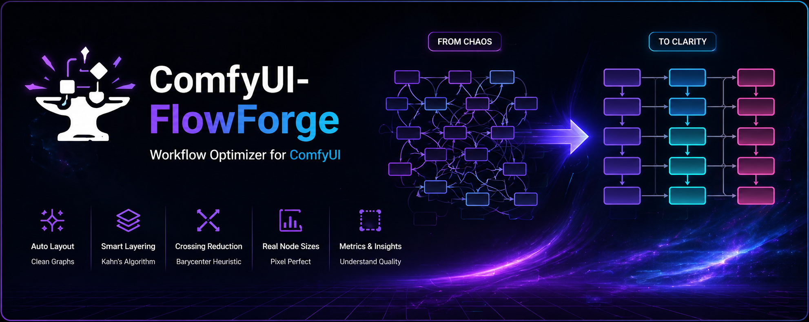

# ComfyUI FlowForge

Automatically rearranges nodes in a [ComfyUI](https://github.com/comfyanonymous/ComfyUI) workflow JSON file so that data flows left-to-right and connection lines stop crossing each other.

---

## The Problem

ComfyUI workflows grow organically. Nodes get added wherever there is space, moved around during iteration, and groups get reorganised. The result is a canvas where connection lines criss-cross in every direction — hard to read and hard to debug.

FlowForge reads a workflow JSON, computes a clean left-to-right layout using a graph algorithm, and writes the result back. **Only node positions and group bounding boxes are changed.** Every connection, setting, model reference, and widget value is preserved exactly.

---

## Requirements

- [uv](https://docs.astral.sh/uv/) — Python package manager (already installed)
- Python ≥ 3.10 (installed automatically by uv when needed)
- The repository pins the local development interpreter to Python 3.12 through `.python-version`

## Installation

### Prerequisites

Ensure **uv** is installed. If not, install it from [astral.sh/uv](https://docs.astral.sh/uv/).

### Install from source

```bash
git clone https://github.com/Delcado19/comfyui-flowforge.git
cd comfyui-flowforge
uv sync
```

This installs all dependencies and the `comfyui-flowforge` package in development mode.

## Quick Start

### CLI Usage

```bash
# Start the API server
uv run flowforge serve

# Apply layout to a workflow file
uv run flowforge layout input.json output.json

# Optimize and layout a workflow
uv run flowforge layout input.json output.json --optimize

# Optimize only
uv run flowforge optimize input.json optimized.json
```

### GUI Usage

```bash
# Start API server and open the web interface
uv run flowforge-gui
```

The GUI opens in your browser at the URL shown in the terminal. It starts at `http://127.0.0.1:5173` and automatically picks the next available frontend port when that port is unavailable.
The launcher also auto-selects an available backend API port and passes it through to the frontend so the browser session stays connected even when local ports are already in use.

### One-Click Launchers

Windows:

```text
start-flowforge.bat
```

Linux:

```bash
sh start-flowforge.sh
```

Both launchers run from the repository root and start `uv run flowforge-gui`.

### Features

- **Workflow JSON Roundtrip**: Preserves ComfyUI workflow metadata while updating layout positions
- **Visual Workflow Canvas**: See how nodes are positioned on a pan/zoom canvas
- **Mini Map and Groups**: Navigate large workflows with a minimap, grouped background regions, group-aware dragging, resizable group containers, and group creation/deletion controls
- **Interactive Controls**: Open, optimize, layout, and save workflows with button clicks plus live X/Y spacing controls for layout density and toolbar buttons to create or clear groups
- **Before/After Comparison**: Toggle ghost outlines of the previous node positions after a layout run
- **Color-Coded Nodes**: Different node types are visually distinguished and rendered with ComfyUI-like widgets
- **Zoom & Pan**: Mouse wheel zoom, plus/minus buttons, and scrollbars for navigation

## How It Works

FlowForge implements a six-phase pipeline:

### Phase 1 — Group Membership

Every node is assigned to the group whose bounding box contains it (using the node's original position). Nodes outside every group form an implicit ungrouped set. When groups overlap, the first matching group in workflow order wins.

### Phase 2 — Inter-Group Topology

A directed graph is built between groups: a group A gets an edge to group B whenever a link crosses from a node in A to a node in B. Before sorting, back-edges are removed by an iterative DFS with white/grey/black colouring — this turns any cyclic group graph into a DAG so the topological sort always produces a valid left-to-right column assignment (see [Known Limitations](#known-limitations) for why cycles arise). The DAG is then sorted using the longest-path algorithm (Kahn's BFS + depth tracking). Groups are assigned to columns from left to right in dependency order. Groups with no ordering relationship share the same column and are stacked vertically, sorted by their original vertical centroid to preserve the author's intended arrangement.

### Phase 3 — Internal Layout (Sugiyama)

Within each group, independently:

1. **Layer assignment** — each node receives a layer number equal to the longest path from any source node to it (`layer = max(layer[predecessor]) + 1`, with sources at layer 0). Uses a topological sort; nodes in cycles (rare in valid ComfyUI workflows) fall back to layer 0.
2. **Crossing minimisation** — nodes within each layer are reordered using the _barycenter heuristic_: each node's score is the average position of its neighbours in the adjacent layer's current order. Two passes are run (forward then backward) to reduce edge crossings.
3. **Coordinate assignment** — nodes are placed on a grid: X increases by layer, Y increases by position within the layer. Bypassed nodes (`mode = 4`) are sorted to the end of their layer so they don't interrupt the active flow. The public `layout` operation evaluates several spacing candidates and applies the most compact result, with additional penalties for layouts that become too wide compared to their height or leave large horizontal gaps. Small workflows try 3 candidates, medium workflows 5, and larger workflows 7. Candidate search can stop early once later variants stop improving, and candidate order is biased by the workflow's overall aspect ratio.

### Phase 4 — Global Positioning

The content size of every group is known after Phase 3. Column widths are determined by the widest group in each column. Groups are placed left-to-right by column and top-to-bottom within each column. Existing group rectangles are treated as containers: manually enlarged groups keep their width and height, and smaller groups expand only as much as needed to contain their nodes with padding. Node positions are translated from group-local coordinates to global canvas coordinates.
Linked ungrouped nodes are arranged in dataflow layers before being placed after the grouped layout, so source-to-target chains continue to move left-to-right instead of being packed only by original Y position. Unlinked ungrouped nodes keep compact vertical packing.

### Phase 5 — Decorative Nodes

Comment nodes (`Note`, `MarkdownNote`, `Label`) carry no dataflow edges and are excluded from the graph algorithm. FlowForge now places them first as a left-side annotation column, ordered by their original Y position, before the rest of the workflow is optimized.

### Phase 6 — Bounding Box Update

Each group's `bounding` rectangle is reconciled with the final positions of its member nodes plus the group padding. Layout never shrinks a larger existing group rectangle; it only moves the group with its contents or expands it when node content would otherwise fall outside. Groups and ungrouped nodes are packed in vertical columns to use the Y axis before widening the workflow.

### Layout Spacing

Layout spacing is driven by two independent values:

| Setting | Default | Range | Description |
| ------- | ------- | ----- | ----------- |
| `node_x_distance` | 80 px | 20-240 px | Controls horizontal spacing, group width, and the left-to-right packing distance. |
| `node_y_distance` | 80 px | 20-240 px | Controls vertical spacing, group height, and the top-to-bottom packing distance. |

The API accepts a layout wrapper of the form `{"workflow": ..., "layout": {"node_x_distance": 80, "node_y_distance": 80}}`. Bare workflow JSON remains supported for backwards compatibility, and legacy `min_node_distance` input is still accepted as an alias for both axes. Each `layout` run tries several axis-spacing candidates and keeps the best-scoring result. The `/layout` response also includes a `X-FlowForge-Layout-Stats` header with the selected candidate and score breakdown.

---

## Optimizer (optional)

Pass `--optimize` to run a pre-layout pass that converts high-fanout `MODEL`, `CLIP`, and `VAE` connections into [Set/Get node pairs](https://github.com/kijai/ComfyUI-KJNodes) (comfyui-kjnodes must be installed in ComfyUI).

**When to use it:** workflows where a single loader node (e.g. `VAELoader`, `UNETLoader`, `CLIPLoader`) fans out to three or more downstream consumers typically have many crossing long-distance wires. Replacing these with Set/Get pairs:

- Eliminates the long wires entirely, which reduces crossing counts after layout.
- Breaks inter-group cycles that loader fan-out would otherwise create, allowing the layout algorithm to produce a strictly left-to-right result.

**What it does:** for every output of type `MODEL`, `CLIP`, or `VAE` with two or more downstream connections, FlowForge estimates the routing cost before and after a rewrite. Local `SetNode -> GetNode` hub links are discounted in that estimate because they behave like a compact distribution spine. Cross-group links are weighted slightly higher so broad inter-group fanouts are prioritized. Candidate savings are recomputed greedily after each rewrite so the optimizer always applies the best remaining candidate on the current graph. The inserted `SetNode` is anchored near the vertical center of its consumer cluster instead of being pinned to the source node's Y position. If the rewritten graph is cheaper, FlowForge inserts one `SetNode` immediately after the source and one `GetNode` before each target. `Reroute` chains are collapsed during detection, so fanout hidden behind reroute nodes is considered too. The original links are removed. The workflow runs identically in ComfyUI.

**Requirement:** comfyui-kjnodes must be installed in your ComfyUI instance, otherwise ComfyUI will show missing-node warnings on load.

---

## Known Limitations

**Residual back-edges after cycle breaking.** When two groups genuinely exchange data bidirectionally (rare in well-structured workflows), the DFS cycle-breaker removes the minimum number of back-edges to produce a DAG. The removed edges become right-to-left wires in the output — typically fewer than 20 % of links in affected workflows. Using `--optimize` often eliminates the root cause by converting loader fan-outs to Set/Get pairs before layout runs.

**Group overlap in the original workflow.** If a node's original position lies inside multiple overlapping group bounding boxes, it is assigned to the first group in workflow order. This is the same behaviour as ComfyUI itself.

**Sub-graph nodes.** Nodes whose type is a UUID (ComfyUI inline sub-graphs) are treated as opaque black boxes. Their internal nodes are not rearranged.

---

## Maintainer Notes

Repository-local agent rules live in [AGENTS.md](AGENTS.md). Documentation synchronization is handled by the Documentation Maintenance Agent policy in [docs/DOCUMENTATION_MAINTENANCE.md](docs/DOCUMENTATION_MAINTENANCE.md).

Release history is tracked in [CHANGELOG.md](CHANGELOG.md). Release and deployment expectations are tracked in [docs/RELEASE.md](docs/RELEASE.md), with frontend asset packaging details in [docs/PACKAGING.md](docs/PACKAGING.md). FlowForge currently supports source-checkout deployment with `uv`; broader distribution targets are still deferred.
GitHub Actions CI runs backend tests, Ruff, Mypy, fixture workflow validation, frontend typecheck, and frontend build on `master`, pull requests, and version tags.
For local maintainer validation against read-only ComfyUI UI workflows, run `uv run python tools/validate_local_workflows.py`.
For release readiness, run `uv run python tools/check_release_ready.py`; add `--tag vX.Y.Z --github` after tagging and publishing to verify remote refs, the GitHub Release, and Actions.
For read-only layout quality metrics across workflow folders, run `uv run python tools/report_layout_quality.py example-workflows`. The report includes aggregate crossing/right-to-left counts and link-category breakdowns for the laid-out result.

---

## Project Structure

```
comfyui-flowforge/
├── .github/workflows/     # GitHub Actions CI
├── .python-version        # Default uv Python version for development and CI parity
├── AGENTS.md             # Repository-local agent rules
├── CHANGELOG.md          # Release history
├── docs/                 # Focused project documentation
├── flowforge/              # Python package
│   ├── __init__.py        # Package exports
│   ├── api.py             # aiohttp API server
│   ├── cli.py             # Command-line interface
│   ├── gui.py             # GUI launcher
│   ├── layout.py          # Layout algorithm (Sugiyama)
│   ├── logger.py          # Logging setup
│   ├── model.py           # Data models (Node, Link, Group, Workflow)
│   ├── optimizer.py       # High-fanout optimizer
│   └── parser.py          # ComfyUI JSON parser
├── frontend/              # Vue 3 frontend
│   ├── src/
│   │   ├── App.vue
│   │   ├── components/    # Vue components
│   │   └── stores/        # Pinia stores
│   └── ...
├── tests/                 # Test suite
│   ├── test_api.py
│   ├── test_layout.py
│   ├── test_optimizer.py
│   └── test_parser.py
├── tools/                 # Maintainer validation scripts
│   ├── build_package_assets.py
│   └── validate_local_workflows.py
├── LICENSE               # MIT license
├── pyproject.toml        # Project configuration
├── start-flowforge.bat   # Windows launcher
├── start-flowforge.sh    # Linux launcher
└── README.md
```

---

## License

MIT License — see [LICENSE](LICENSE) file for details.
